# StockWiz - Diagrama de Infraestructura AWS

## Arquitectura Completa en AWS

```mermaid
graph TB
    subgraph Internet["🌐 Internet"]
        Users[👥 Users / CI/CD Pipeline]
    end

    subgraph AWS["☁️ AWS Cloud - Region: us-east-1"]
        subgraph VPC["🔒 VPC (10.0.0.0/16)"]

            subgraph PublicSubnets["📡 Public Subnets"]
                subgraph AZ1Public["AZ us-east-1a<br/>10.0.1.0/24"]
                    ALB1[⚖️ Application<br/>Load Balancer<br/>dev-alb]
                end

                subgraph AZ2Public["AZ us-east-1b<br/>10.0.2.0/24"]
                    ALB2[⚖️ ALB<br/>Standby]
                end

                IGW[🌍 Internet<br/>Gateway]
            end

            subgraph PrivateSubnets["🔐 Private Subnets"]
                subgraph AZ1Private["AZ us-east-1a<br/>10.0.11.0/24"]
                    ECSTask1[📦 ECS Task<br/>Fargate]
                end

                subgraph AZ2Private["AZ us-east-1b<br/>10.0.12.0/24"]
                    ECSTask2[📦 ECS Task<br/>Fargate Standby]
                end

                NAT[🔌 NAT<br/>Gateway]
            end

            subgraph ECSCluster["🐳 ECS Cluster: dev-cluster"]
                subgraph TaskDef["📋 Task Definition: dev-stockwiz<br/>CPU: 2048 | Memory: 4096MB"]

                    subgraph Container1["Container: postgres"]
                        Postgres[(🗄️ PostgreSQL<br/>Port: 5432<br/>DB: microservices_db)]
                    end

                    subgraph Container2["Container: redis"]
                        Redis[💾 Redis<br/>Port: 6379<br/>Cache Layer]
                    end

                    subgraph Container3["Container: api-gateway"]
                        APIGateway[🚪 API Gateway<br/>Port: 8000<br/>Go/Chi Router]
                    end

                    subgraph Container4["Container: product-service"]
                        ProductService[📦 Product Service<br/>Port: 8001<br/>Python/FastAPI]
                    end

                    subgraph Container5["Container: inventory-service"]
                        InventoryService[📊 Inventory Service<br/>Port: 8002<br/>Go/Chi]
                    end
                end
            end

            subgraph SecurityGroups["🛡️ Security Groups"]
                ALBSG[ALB SG<br/>Allow: 80, 443]
                ECSSG[ECS SG<br/>Allow: 8000-8002, 5432, 6379]
            end
        end

        subgraph ECR["📦 Elastic Container Registry"]
            ECR1[dev-stockwiz-api-gateway:latest]
            ECR2[dev-stockwiz-product-service:latest]
            ECR3[dev-stockwiz-inventory-service:latest]
            ECR4[dev-stockwiz-postgres:latest]
        end

        subgraph Monitoring["📊 CloudWatch & Monitoring"]
            CWLogs[📝 CloudWatch Logs<br/>/ecs/dev]
            CWAlarms[🚨 CloudWatch Alarms<br/>- High CPU<br/>- High Memory<br/>- Health Check Fails]
            SNS[📧 SNS Topic<br/>dev-alerts<br/>→ yokadance@gmail.com]
        end

        subgraph Storage["💾 S3"]
            S3State[🗂️ Terraform State<br/>stockwiz-terraform-state-493930199663]
        end
    end

    subgraph GitHub["🔧 GitHub Actions"]
        Pipeline[⚙️ CI/CD Pipeline<br/>dev-pipeline.yml]
        SonarCloud[🔍 SonarCloud<br/>Code Quality & Coverage]
    end

    %% Connections
    Users -->|HTTP/HTTPS| IGW
    IGW --> ALB1
    IGW --> ALB2
    ALB1 -->|Port 8000| APIGateway
    ALB2 -.->|Failover| APIGateway

    APIGateway -->|/api/products| ProductService
    APIGateway -->|/api/inventory| InventoryService

    ProductService -->|SQL| Postgres
    InventoryService -->|SQL| Postgres
    ProductService -->|Cache| Redis
    InventoryService -->|Cache| Redis
    APIGateway -->|Cache| Redis

    ECSTask1 --> Postgres
    ECSTask1 --> Redis
    ECSTask1 --> APIGateway
    ECSTask1 --> ProductService
    ECSTask1 --> InventoryService

    Pipeline -->|Build & Push| ECR1
    Pipeline -->|Build & Push| ECR2
    Pipeline -->|Build & Push| ECR3
    Pipeline -->|Build & Push| ECR4

    ECR1 -.->|Pull Image| APIGateway
    ECR2 -.->|Pull Image| ProductService
    ECR3 -.->|Pull Image| InventoryService
    ECR4 -.->|Pull Image| Postgres

    ECSTask1 -->|Logs| CWLogs
    ALB1 -->|Metrics| CWAlarms
    ECSTask1 -->|Metrics| CWAlarms
    CWAlarms -->|Alert| SNS

    Pipeline -->|Terraform State| S3State
    Pipeline -->|Code Analysis| SonarCloud

    PrivateSubnets -->|Outbound| NAT
    NAT --> IGW

    %% Styling
    classDef aws fill:#FF9900,stroke:#232F3E,stroke-width:2px,color:#fff
    classDef container fill:#0066CC,stroke:#232F3E,stroke-width:2px,color:#fff
    classDef database fill:#527FFF,stroke:#232F3E,stroke-width:2px,color:#fff
    classDef monitoring fill:#FF6B6B,stroke:#232F3E,stroke-width:2px,color:#fff
    classDef security fill:#4ECDC4,stroke:#232F3E,stroke-width:2px,color:#fff
    classDef external fill:#95E1D3,stroke:#232F3E,stroke-width:2px,color:#000

    class ALB1,ALB2,IGW,NAT aws
    class APIGateway,ProductService,InventoryService container
    class Postgres,Redis database
    class CWLogs,CWAlarms,SNS monitoring
    class ALBSG,ECSSG security
    class Users,Pipeline,SonarCloud external
```



## Componentes Principales

### 🌐 Networking (VPC)
- **VPC CIDR**: 10.0.0.0/16
- **Availability Zones**: us-east-1a, us-east-1b
- **Public Subnets**: 10.0.1.0/24, 10.0.2.0/24
- **Private Subnets**: 10.0.11.0/24, 10.0.12.0/24
- **Internet Gateway**: Conecta VPC a Internet
- **NAT Gateway**: Permite salida a Internet desde subnets privadas

### ⚖️ Application Load Balancer (ALB)
- **Nombre**: dev-alb
- **DNS**: dev-alb-XXXXXXXXX.us-east-1.elb.amazonaws.com
- **Listener**: Puerto 80 (HTTP)
- **Target Groups**:
  - `dev-api-gw-tg` → API Gateway (puerto 8000)
  - `dev-product-svc-tg` → Product Service (puerto 8001)
  - `dev-inventory-svc-tg` → Inventory Service (puerto 8002)
- **Routing Rules**:
  - `/` → API Gateway (default)
  - `/products/*` → Product Service
  - `/inventory/*` → Inventory Service

### 🐳 ECS Cluster
- **Nombre**: dev-cluster
- **Launch Type**: AWS Fargate (serverless)
- **Service**: dev-stockwiz
- **Desired Count**: 1 task
- **Task Resources**:
  - CPU: 2048 (2 vCPU)
  - Memory: 4096 MB (4 GB)

### 📦 Containers en ECS Task

#### 1. API Gateway (Go)
- **Puerto**: 8000
- **Framework**: Chi Router
- **Función**: Punto de entrada principal, enruta requests a microservicios
- **Endpoints**:
  - `/health` → Health check
  - `/api/products/*` → Proxy a Product Service
  - `/api/inventory/*` → Proxy a Inventory Service

#### 2. Product Service (Python)
- **Puerto**: 8001
- **Framework**: FastAPI
- **Función**: Gestión de productos
- **Base de datos**: PostgreSQL
- **Cache**: Redis

#### 3. Inventory Service (Go)
- **Puerto**: 8002
- **Framework**: Chi
- **Función**: Gestión de inventario
- **Base de datos**: PostgreSQL
- **Cache**: Redis

#### 4. PostgreSQL
- **Puerto**: 5432
- **Versión**: Latest (custom image)
- **Database**: microservices_db
- **Usuarios**: admin

#### 5. Redis
- **Puerto**: 6379
- **Imagen**: redis:7-alpine
- **Función**: Cache compartido entre servicios

### 📦 ECR Repositories
1. **dev-stockwiz-api-gateway**
2. **dev-stockwiz-product-service**
3. **dev-stockwiz-inventory-service**
4. **dev-stockwiz-postgres**

### 📊 Monitoring & Logs

#### CloudWatch Logs
- **Log Group**: /ecs/dev
- **Retention**: 7 días
- **Streams**:
  - postgres
  - redis
  - api-gateway
  - product-service
  - inventory-service

#### CloudWatch Alarms
- **High CPU Usage**: > 80%
- **High Memory Usage**: > 80%
- **Unhealthy Target Count**: > 0
- **HTTP 5xx Errors**: > 10

#### SNS Notifications
- **Topic**: dev-alerts
- **Subscription**: yokadance@gmail.com

### 🛡️ Security Groups

#### ALB Security Group
- **Inbound**:
  - Port 80 (HTTP) from 0.0.0.0/0
  - Port 443 (HTTPS) from 0.0.0.0/0
- **Outbound**: All traffic

#### ECS Tasks Security Group
- **Inbound**:
  - Port 8000-8002 from ALB SG
  - Port 5432 (PostgreSQL) internal
  - Port 6379 (Redis) internal
- **Outbound**: All traffic

### 🔧 CI/CD Pipeline

#### GitHub Actions Workflow
1. **Tests & Quality**:
   - Python tests (pytest) → Coverage: ~38%
   - Go tests (API Gateway) → Coverage: ~53.6%
   - Go tests (Inventory) → Coverage: ~4.7%
   - SonarCloud analysis

2. **Build & Push**:
   - Build Docker images
   - Push to ECR repositories
   - Tag: latest & commit SHA

3. **Deploy to ECS**:
   - Update service: dev-stockwiz
   - Force new deployment
   - Wait for service stability

4. **Health Checks**:
   - Verify ALB endpoint
   - Test /health endpoint

5. **Functional Tests**:
   - Newman/Postman tests
   - API integration tests

### 💾 Infrastructure State
- **Backend**: S3
- **Bucket**: stockwiz-terraform-state-493930199663
- **Key**: dev/terraform.tfstate
- **Encryption**: Enabled
- **Versioning**: Enabled

## Flujo de Tráfico

```
Usuario → Internet Gateway → ALB (dev-alb)
    ↓
    → API Gateway (:8000) → /health
    ↓                     → /api/products → Product Service (:8001) → PostgreSQL + Redis
    ↓                     → /api/inventory → Inventory Service (:8002) → PostgreSQL + Redis
    ↓
    → CloudWatch Logs + Metrics
```

## URLs y Endpoints

### ALB DNS
```
http://dev-alb-XXXXXXXXX.us-east-1.elb.amazonaws.com
```

### Endpoints Públicos
```bash
# Health Check
GET http://dev-alb-XXX.us-east-1.elb.amazonaws.com/health

# Products API
GET    http://dev-alb-XXX.us-east-1.elb.amazonaws.com/api/products
POST   http://dev-alb-XXX.us-east-1.elb.amazonaws.com/api/products
GET    http://dev-alb-XXX.us-east-1.elb.amazonaws.com/api/products/{id}
PUT    http://dev-alb-XXX.us-east-1.elb.amazonaws.com/api/products/{id}
DELETE http://dev-alb-XXX.us-east-1.elb.amazonaws.com/api/products/{id}

# Inventory API
GET    http://dev-alb-XXX.us-east-1.elb.amazonaws.com/api/inventory
POST   http://dev-alb-XXX.us-east-1.elb.amazonaws.com/api/inventory
GET    http://dev-alb-XXX.us-east-1.elb.amazonaws.com/api/inventory/{id}
PUT    http://dev-alb-XXX.us-east-1.elb.amazonaws.com/api/inventory/{id}
```

## Costos Estimados (Mensual)

| Recurso | Costo Aprox. |
|---------|--------------|
| ECS Fargate (1 task, 2 vCPU, 4GB) | ~$30-40 |
| ALB | ~$20-25 |
| NAT Gateway | ~$30-35 |
| CloudWatch Logs (7 días) | ~$5-10 |
| ECR Storage | ~$1-5 |
| Data Transfer | ~$10-20 |
| **TOTAL** | **~$96-135/mes** |

---

**Nota**: Este diagrama representa el entorno de **desarrollo (dev)**. Para producción se recomienda:
- RDS en lugar de PostgreSQL containerizado
- ElastiCache en lugar de Redis containerizado
- Auto Scaling para ECS tasks
- WAF en el ALB
- Multi-AZ deployment
- Route53 con dominio personalizado
